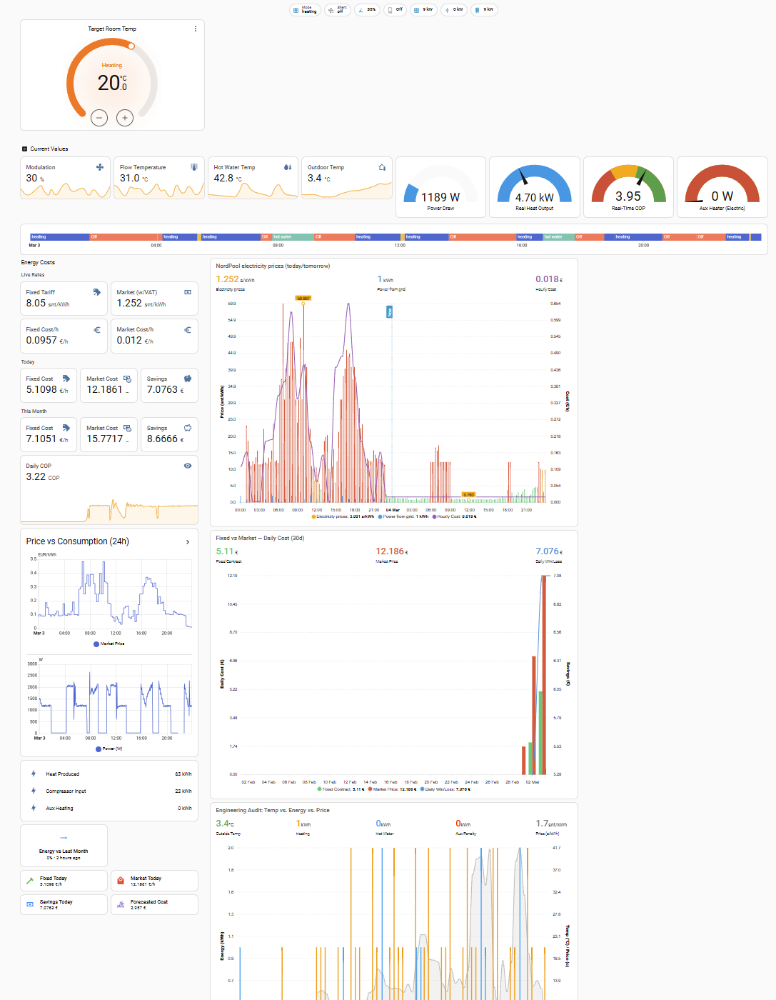

# Bosch Compress 7001i AW — Home Assistant Integration via EMS-ESP

A ready-to-use Home Assistant configuration for monitoring and controlling the **Bosch Compress 7001i AW** heat pump (and similar models such as Compress 5800/6800i AW) via the [BBQKees EMS interface board](https://bbqkees-electronics.nl) bridge board paired with a **LilyGO T7 S3 16 MB ESP32** board and a 5 V step-down converter.





---

## Hardware Setup

### Required Components

| Component | Description |
|---|---|
| **EMS-ESP Interface Board v3.1** | BBQKees interface board — connects via the heat pump's service jack |
| **LilyGO T7 S3 16 MB ESP32** | Main MCU; runs the EMS-ESP firmware |
| **5 V DC–DC Step-Down Module** | Steps down the service jack supply voltage to 5 V for the ESP32 |

### Interface Board

The interface board used is the [BBQKees Interface Board v3.1](https://bbqkees-electronics.nl/wiki/interface-board/interface-board-v3-1.html).  
The BBQKees board supports two connection methods — EMS bus terminals (2-wire) or the **service jack** (RJ-style connector on the heat pump). This setup uses the **service jack**, which carries both the EMS data signal and a supply voltage. This means **no external power supply is needed**: the service jack already provides enough voltage to power the ESP32 via a 5 V step-down converter. Use good quality cable like the [EMS Service Cable 110cm](https://bbqkees-electronics.nl/product/ems-service-cable-110cm/).

### Wiring Overview

```
Bosch Compress Service Jack
  (EMS data + supply voltage)
        │
        ▼
BBQKees Interface Board v3.1
  ├── UART TX/RX ──────────────► LilyGO T7 S3 ESP32 (16 MB)
  └── Supply voltage out ──────► DC–DC Step-Down (→ 5 V) ──► ESP32 5 V pin and GND
```

> The service jack eliminates the need for a separate 12 V or 24 V power brick. The step-down module handles the voltage regulation so the ESP32 receives a clean 5 V.

---

## Firmware

Flash the ESP32 with the latest [EMS-ESP firmware](https://github.com/emsesp/EMS-ESP32).  
Follow the [official installation guide](https://emsesp.org/Installing) for full details.

For the **LilyGO T7 S3 16 MB** board, download the binary named:

```
EMS-ESP-x_x_x-ESP32S3-16MB+.bin (replace x_x_x with the latest version number)
```

from the [EMS-ESP releases page](https://github.com/emsesp/EMS-ESP32/releases) and flash it using the [EMS-ESP Flasher](https://github.com/emsesp/EMS-ESP-Flasher/releases) — a standalone GUI tool purpose-built for this firmware.


After first boot, connect to the `ems-esp` Wi-Fi hotspot and configure:
- Your home Wi-Fi credentials
- MQTT broker (point to your Home Assistant instance)
- Enable **MQTT Discovery** so entities appear in HA automatically

Once connected to your home network, the EMS-ESP web UI is accessible at **http://ems-esp.local/**

Then in the EMS-ESP web UI go to **Settings → Application → Hardware Settings** and set:
- **Board profile** → `LilyGO T7 S3`
- **EMS Tx Mode** → `EMS+`

Without these settings the board will not communicate correctly with the heat pump.

---

## Home Assistant Setup

### Installation Method

This setup runs **Home Assistant OS inside Hyper-V** on Windows. Using Home Assistant OS (rather than Container or Core) is required to be able to install **add-ons**.

### Required Add-ons

Install the following add-ons from the Home Assistant Add-on Store:

| Add-on | Purpose |
|---|---|
| **Mosquitto broker** | MQTT broker — receives data from EMS-ESP |
| **Cloudflared** | Secure remote access via Cloudflare Tunnel |
| **File editor** | Edit automations.yaml and configuration.yaml files directly in the HA web UI |
| **HACS** (Home Assistant Community Store) | Required to install custom cards (ApexCharts, card-mod) |


### Prerequisites

- **MQTT integration** — configure it to use the Mosquitto broker add-on
- **Nord Pool integration** (optional — used for electricity price sensors, configured for your country/region)
- **Custom cards** from HACS for the dashboard (optional):
  - [ApexCharts Card](https://github.com/RomRider/apexcharts-card)
  - [card-mod](https://github.com/thomasloven/lovelace-card-mod)

### Remote Access

This setup uses a **Cloudflare Tunnel** (cloudflared) for secure remote access to Home Assistant, with **Cloudflare Zero Trust** policies restricting who can reach it. This avoids exposing any ports directly to the internet.

The `configuration.yaml` includes the required reverse proxy headers for this:

```yaml
http:
  use_x_forwarded_for: true
  trusted_proxies:
    - 172.30.33.0/24
```

Adjust the trusted proxy CIDR to match your cloudflared container's network if different.

### File Layout

```
configuration.yaml      # Core HA config: sensors, template sensors, utility meters
automations.yaml        # MQTT discovery fix automations (state_class, force_update)
bosch_7001i.yaml        # Lovelace dashboard — full UI for the heat pump
ems-esp/
  ems-esp.json          # Snapshot of http://ems-esp/api/boiler — all boiler entity values
  entities.md           # Reference: all EMS-ESP entity IDs with descriptions
  compress_entities_ems_esp.csv   # Entity list in CSV format
  hpc410.csv            # HPC410 controller entity reference
```

### Installation

1. **Copy files** from this repository into your Home Assistant config directory (typically `/config`).

2. **Include the package** in your `configuration.yaml` if you use a split config, or merge the relevant sections.

3. **Restart Home Assistant** and verify that EMS-ESP MQTT entities appear under  
   `Settings → Devices & Services → MQTT`.

4. **Add the dashboard** by importing `bosch_7001i.yaml` as a new Lovelace view via  
   `Dashboard → Edit → Raw configuration editor`.

---

## Features

### Monitoring

| Sensor | Entity ID |
|---|---|
| Compressor speed | `sensor.boiler_hpcompspd` |
| Flow temperature | `sensor.boiler_curflowtemp` |
| Return temperature | `sensor.boiler_rettemp` |
| Outdoor temperature | `sensor.boiler_outdoortemp` |
| Hot water tank temp | `sensor.boiler_hptw1` |
| Current power draw | `sensor.boiler_hpcurrpower` |
| HP activity / mode | `sensor.boiler_hpactivity` |

### Computed Sensors (Template)

- **Real-Time COP** — compressor heat output divided by electrical input
- **Heating Loop Delta T** — flow vs. return temperature difference
- **Daily COP** — cumulative daily heat produced / electricity consumed
- **HP Defrost Detection** — monitors defrost cycles and counts daily events
- **Heat Pump Age / Uptime** — formatted from internal UBA uptime counter
- **Error Description** — human-readable translation of `sensor.boiler_lastcode`

### Energy & Cost Tracking

- **Utility Meters** — daily and monthly energy broken down by:
  - Compressor heating
  - Auxiliary electric heater
  - Domestic hot water (DHW)
- **Fixed-Tariff Cost Sensor** — Estonian two-tariff contract (day/night rates with 24 % VAT)
- **Nord Pool Market Price** — live spot price with VAT applied
- **Daily / Monthly Cost Comparison** — fixed contract vs. market, with savings calculated
- **Predicted Heating Cost (24 h)** — uses hourly weather forecast + watt-per-degree estimate

### Dashboard (`bosch_7001i.yaml`)

- Thermostat card for room temperature target (HC1)
- Live gauges: power draw, heat output, COP, aux heater load
- 24 h HP activity history graph
- NordPool price chart with colour thresholds (today + tomorrow)
- Engineering audit chart: outdoor temp vs. energy breakdown vs. price
- Monthly trend tile with colour-coded background (green = better than last month)
- Fixed vs. market daily cost bar chart (30-day view)

### Automations (`automations.yaml`)

MQTT discovery payload fixups applied at startup:
- Adds `force_update: true` to cumulative energy sensors so HA records every value change
- Injects `state_class: total_increasing` + `device_class: energy` into sensors that do not advertise these fields natively (required for HA energy dashboard and "today change" statistics)

---

## Entity Reference

The `ems-esp/entities.md` file contains the full entity table sourced from the Bosch/Buderus community documentation (covers all 166+ EMS-ESP boiler entities).  
Key groupings:

- **Energy values** — `nrg*`, `meter*` (thermal produced vs. electrical consumed)
- **Temperatures** — flow, return, outdoor, DHW, heat pump internals
- **Status** — HP activity, pump states, silent mode
- **Settings** — max compressor speed, DHW target, PV relay input
- **Statistics** — compressor start counts, operating hours

---

## Compatible Models

This configuration is known to work with:

- Bosch Compress 7001i AW

But might also be compatible with other Bosch/Buderus models that use the EMS bus, such as:

- Bosch Compress 5800i AW / 6800i AW
- Buderus Logatherm WLW176i / WLW186i


---

## References

- [EMS-ESP project](https://emsesp.org/)
- [EMS-ESP32 firmware on GitHub](https://github.com/emsesp/EMS-ESP32)
- [BBQKees Interface Board v3.1 Wiki](https://bbqkees-electronics.nl/wiki/interface-board/interface-board-v3-1.html)
- [Bosch/Buderus community docs (DE)](https://bosch-buderus-wp.github.io/)

---

## License

This project is shared as-is for personal/hobbyist use. No warranty is provided.  
All product names are trademarks of their respective owners.
